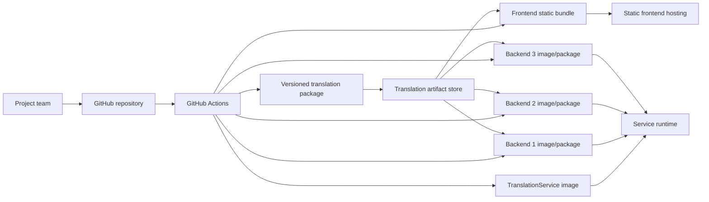
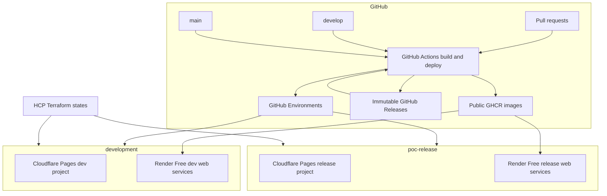

# AI Translation Platform - CI/CD and Deployment Architecture

| Field | Value |
| --- | --- |
| Status | Draft 0.2 - for discussion |
| Date | 2026-07-30 |
| Repository | `PocProjects2026/AITranslationsPlatformPoc` |
| Integration branch | `develop` |
| Release branch | `main` |
| Cost rule | Zero paid technology; quota exhaustion must fail closed |
| Scope | General architecture, CI/CD, deployment, infrastructure, security, operations, and cost |

## 1. How to Review This Document

This is the single architecture document for the first platform foundation. It is intentionally complete enough to review end to end, but it does not define implementation-level YAML, Dockerfiles, Terraform modules, or application code.

Use these labels when reviewing:

- **Constraint**: already established by the project.
- **Recommended**: the proposed direction unless review identifies a better option.
- **Decision needed**: agreement is required before implementation.
- **Deferred**: intentionally outside the first foundation.
- **Accepted risk**: a known POC limitation that must be visible.

A manageable review order is:

1. Sections 2 to 6: scope, principles, and target platform.
2. Sections 7 to 11: delivery, environments, CI/CD, and versioning.
3. Sections 12 to 17: infrastructure, security, operations, cost, and open decisions.

Record feedback as `Accepted`, `Change required`, or `Open question`. The document will be refined before an implementation plan is created.

## 2. Purpose

The platform must allow a small team to build and deploy independently:

- one Angular frontend;
- one Python TranslationService;
- three backend services implemented with different technologies;
- versioned translation artifacts consumed by the frontend and all three backends.

The foundation should provide the important strengths of the Bobst delivery model while using GitHub Actions, Docker where it adds value, portable infrastructure as code, and zero-cost POC services.

The primary architecture outcome is a reproducible answer to:

> Which source commit, deployable artifact, infrastructure version, and translation-artifact version are running in each environment?

## 3. Scope and Non-Goals

### 3.1 In scope

- repository and branch delivery model;
- independently deployable components;
- CI quality gates;
- CD flows for `develop` and `main`;
- Docker's role;
- translation artifact publication and consumption boundary;
- infrastructure as code and state;
- environments, identity, secrets, and approvals;
- software supply-chain security;
- deployment evidence, smoke tests, rollback, and basic observability;
- cost and portability constraints.

### 3.2 Out of scope

- translation algorithms;
- embeddings, data science, or candidate ranking;
- detailed API and domain design;
- detailed application observability instrumentation;
- production-scale networking, multi-region availability, and disaster recovery;
- exact workflow, Dockerfile, or Terraform implementation;
- the content of PRs 13 and 14. Those PRs can be adjusted later against the approved architecture.

## 4. Architecture Drivers

| Driver | Consequence |
| --- | --- |
| Three-person team | Minimize operational platforms and duplicated pipeline logic. |
| Public GitHub repository | Use public-repository GitHub features, but assume workflow code is visible and may receive untrusted pull requests. |
| Zero-cost requirement | No paid plan, paid license, metered overage, or expiring trial may be used. Quota exhaustion must fail or suspend service instead of creating a charge. |
| Near-production foundations | Use immutable versions, approvals, least privilege, remote state, repeatable deployments, and rollback evidence from the start. |
| Different backend technologies | Standardize the delivery contract, not the internal framework. |
| Independently deployable services | Each component owns its build, deployment unit, version, deployment, and rollback. |
| Translation artifact reuse | Translation data is a separately versioned product, not an untracked build by-product. |
| Future Azure portability | Prefer OCI containers and Terraform; isolate provider-specific deployment adapters. |
| No developer-machine dependency | Every CI build starts from source, lock files, and declared tool versions on hosted runners. |

## 5. Lessons Retained From Bobst

The Bobst MaintenanceService model uses Azure Pipelines, PowerShell and Azure templates, with ZIP packages as deployment units. Docker is not the core deployment unit there. Azure supplies the managed runtime and the pipeline deploys versioned ZIP outputs.

The goal is to preserve the engineering properties, not reproduce the exact tooling.

| Bobst property | Platform equivalent |
| --- | --- |
| Per-service pipeline ownership | Per-component reusable CI and deployment workflows |
| Separate feature validation | Pull-request CI without deployment credentials |
| Automatic development deployment | Successful `develop` changes deploy to `development` |
| Protected release deployment | `main` deploys through the protected `poc-release` environment |
| Infrastructure before application | Terraform plan/apply is separate from application deployment |
| Versioned ZIP packages | Static bundles, OCI images, and translation packages with digests |
| Slots and package rollback | Provider rollback where available, plus exact static-bundle or image-digest redeployment |
| Smoke and integration tests | Post-deployment health, route, locale, and version checks |
| Reusable pipeline templates | Reusable GitHub workflows and small shared actions/scripts |
| Operational workflows | Explicit rollback and infrastructure workflows |

The following Bobst patterns should not be copied:

- duplicated environment-specific pipeline YAML;
- large provider-specific PowerShell orchestration;
- selection of `latestFromBranch`;
- hidden configuration in the CI/CD platform;
- rebuilding the same release differently for each environment;
- scripts coupled to Azure DevOps logging commands;
- deployment decisions that cannot be reconstructed from source and deployment records.

PowerShell can still be used for small, testable cross-platform scripts where it is the clearest tool. GitHub Actions remains the orchestrator, and Terraform owns infrastructure state.

## 6. System and Delivery Context

### 6.1 Logical context



The arrows from the artifact store to consumer builds represent selection of an explicit translation version. Consumers never resolve an unqualified `latest` version during deployment.

### 6.2 Deployable units

| Unit | Build output | Deployment target | Translation relationship |
| --- | --- | --- | --- |
| FrontendApp | Localized static bundle | Static hosting | Selected XLIFF translations are packaged into the bundle |
| TranslationService | OCI image | Container or job runtime | Publishes validated versioned artifacts |
| BackendService1 | OCI image or native package | Technology-compatible runtime | Selected JSON translations are packaged into the deployment unit |
| BackendService2 | OCI image or native package | Technology-compatible runtime | Same contract |
| BackendService3 | OCI image or native package | Technology-compatible runtime | Same contract |
| Translation artifact product | Manifest, checksums, XLIFF and JSON files | Durable object store | Immutable input to consumer builds |

**Recommended:** use OCI images for TranslationService and each backend that can run correctly in a container. A backend may use a native serverless package only when its technology makes a container inappropriate and the alternative satisfies the zero-cost rule. This exception must not weaken versioning, evidence, or rollback requirements.

### 6.3 What Docker does

Docker is a packaging and runtime boundary. It is not the CI/CD system and it does not replace infrastructure as code.

Docker provides:

- the same declared runtime and system dependencies in CI and hosting;
- an independently deployable unit for each service;
- portability across container hosts;
- an image digest that identifies exactly what was deployed;
- a standard place for runtime hardening and vulnerability scanning.

Docker does not provide:

- branch and pull-request governance;
- environment approvals or secrets;
- cloud infrastructure;
- translation artifact version selection;
- deployment orchestration;
- rollback policy by itself.

For FrontendApp, the primary deployment unit is the compiled static bundle. A frontend container is optional and should only be introduced for a host that requires it or for portability testing. Shipping a web server container to host static files is unnecessary for the initial Cloudflare Pages direction.

The architecture does not require a paid Docker subscription or paid Docker Desktop license. CI uses the OCI/Dockerfile toolchain available on GitHub-hosted runners and publishes to public GHCR. Developers may use a legally available Docker Engine, Docker Desktop entitlement, Podman, or another OCI-compatible local tool; CI remains authoritative.

## 7. Proposed Target Platform

### 7.1 Platform choices

| Capability | Proposed service | Status | Reason |
| --- | --- | --- | --- |
| Source and collaboration | GitHub | Constraint | Existing public repository and pull-request workflow |
| CI/CD orchestration | GitHub Actions hosted runners | Constraint | Main platform direction; public repositories can use standard hosted runners without Actions minute charges |
| Static frontend | Two Cloudflare Pages Free projects | Recommended | No-cost static delivery, preview support, and independent development/release rollback |
| Container registry | Public GitHub Container Registry | Recommended | OCI registry integrated with the repository; current public-container usage is free |
| Dynamic service runtime | Render Free web services | Decision needed | Docker support and fail-closed quota behavior when no payment method is configured |
| Translation artifact store | GitHub immutable Releases | Recommended | No-cost durable release assets with locked tags, assets, and generated attestations |
| Deployment evidence store | GitHub deployments plus immutable release-set assets | Recommended | No-cost durable records independent of workflow-log retention |
| Infrastructure as code | Terraform | Constraint | Portable declarative infrastructure and clear state ownership |
| Terraform state | HCP Terraform Free organization | Recommended | Remote encrypted state, locking, and no custom state backend to operate |
| Environment controls | GitHub Environments | Constraint | Configuration, secrets, approval, branch restrictions, and deployment history |
| Basic telemetry | Provider logs plus GitHub deployment evidence | Recommended | Sufficient first foundation without adding a paid observability platform |

### 7.2 Zero-cost qualification rule

A provider is allowed only when all of the following are true:

- the selected plan and every provisioned resource have a zero price;
- no expiring credit or time-limited trial is required;
- no payment method is attached where the provider permits operation without one;
- quota exhaustion suspends, throttles, or rejects work rather than billing overage;
- infrastructure code explicitly selects the free plan and CI rejects paid plan identifiers;
- the team reviews provider terms before initial provisioning and after a notified change.

Services with a permanent free grant but automatic pay-as-you-go overage do not qualify. This removes Azure Container Apps, Cloudflare R2, Cloud Run, and similar metered services from the first POC foundation.

This rule applies to hosting, CI/CD, registries, artifact storage, infrastructure state, observability, security scanning, software licenses, and external application services. Technical areas outside this document must honor the same project-wide constraint.

### 7.3 Why Render Free is the service-runtime candidate

Render Free web services currently support Docker, HTTPS, custom domains, logs, health checks, and limited rollback. When no payment method is configured, exhaustion of included bandwidth or build capacity suspends services or builds instead of generating a charge.

The free runtime has important consequences:

- only public web services qualify; free private services, background workers, and cron jobs are not available;
- services sleep after 15 minutes without inbound traffic and can take about one minute to restart;
- a workspace receives 750 free running instance-hours per month, shared by all free web services;
- filesystems are ephemeral;
- free services cannot scale beyond one instance;
- availability is not guaranteed and Render may restart or suspend a service;
- provider rollback is limited, so durable GHCR images and digest-based redeployment remain authoritative.

TranslationService therefore needs a small authenticated HTTP execution adapter if it must run on Render Free. Alternatively, translation processing can remain an explicitly triggered build-time operation until a no-cost worker host exists. This statement concerns hosting only, not translation implementation.

The runtime decision remains open until the execution model of all three backends is known. HTTP services, queue workers, scheduled jobs, persistent processes, and stateful applications have different hosting needs.

### 7.4 Environment topology



**Recommended:** create separate Render services for development and release, with separate names, configuration, secrets, deployment history, and Terraform state. All services share the Render workspace's free-hour allowance, so they are expected to sleep and may be suspended when the allowance is exhausted.

## 8. Translation Artifact Contract

This section defines the delivery boundary only. It does not define how translations are produced.

### 8.1 Package layout

A published version uses a GitHub Release tag such as `translations/v1.2.0`. Its archive should resemble:

```text
manifest.json
checksums.sha256
frontend/
  messages.fr.xlf
  messages.de.xlf
backend/
  backend.fr.json
  backend.de.json
```

The manifest must identify at least:

- schema version;
- translation artifact version;
- source repository and commit;
- publishing workflow run;
- creation timestamp;
- included locales and files;
- SHA-256 digest and size for every file;
- compatibility metadata needed by consumers;
- optional provenance or signature references.

### 8.2 Publication rules

- GitHub immutable Releases must be enabled before the first artifact publication.
- The workflow creates a draft release, uploads the archive, manifest, and checksum assets, and publishes only after validation.
- Published release tags and assets are immutable.
- Publishing an existing version with different bytes fails.
- Publication validates schema, required locales, required files, parseability, and checksums.
- Publication uses a protected GitHub Environment and a job-scoped `contents: write` permission.
- Failed or partial uploads never become selectable.
- A manifest is published only after all referenced files are successfully stored.
- Retention is indefinite for any version referenced by a deployment record.

### 8.3 Consumer selection

**Recommended:** each consumer keeps its selected translation version and expected manifest digest in a committed lock file, for example:

```json
{
  "translationVersion": "1.2.0",
  "manifestSha256": "<sha256>"
}
```

The exact filename and schema will be decided during implementation. The architecture requirement is that version selection is explicit, reviewed, and reproducible.

At build time, a consumer:

1. reads the committed selection;
2. downloads that exact version;
3. verifies the manifest digest and file checksums;
4. validates files for its own technology;
5. packages the files into its deployable unit;
6. records the version and digest in deployment evidence.

Mutable aliases such as `latest`, `latest-approved`, `develop`, or `production` may exist for human discovery, but automation must not deploy from them.

## 9. Environment and Promotion Model

| Property | `development` | `poc-release` |
| --- | --- | --- |
| Source branch | `develop` | `main` |
| Deployment | Automatic after all gates pass | Automatic start, then protected approval |
| Reviewer | None initially | Required reviewer; initiator cannot self-approve |
| Concurrency | One deployment per component/environment | One deployment per component/environment |
| Secrets | Development scope only | Separate release scope |
| Infrastructure state | Development state/workspace | Release state/workspace |
| Frontend target | Development Pages project | Release Pages project |
| Service target | Development apps/environment | Release apps/environment |
| Rollback | Explicit workflow | Explicit protected workflow |

### 9.1 Feature branches

Feature and fix branches:

- run CI in pull requests;
- receive no deployment credentials;
- may create a Cloudflare frontend preview only after its exposure and secret model is approved;
- do not create long-lived backend environments in the first foundation.

This preserves Bobst's feature validation without paying for or operating an environment per branch.

### 9.2 Development flow

1. A feature or fix branch opens a pull request to `develop`.
2. The stable repository CI gate runs all relevant component checks.
3. Required review and branch rules permit merge.
4. The `develop` push rebuilds and validates each changed deployable unit.
5. Images and static artifacts are published with immutable identifiers.
6. Each changed component deploys independently to `development`.
7. Smoke tests and evidence recording complete the deployment.
8. A failure leaves the previous working deployment available for rollback.

### 9.3 Release flow

1. A pull request promotes reviewed changes from `develop` to `main`.
2. The full release CI gate runs, even when path detection suggests a narrow change.
3. Deployable units are produced and published immutably.
4. The release deployment job targets the `poc-release` GitHub Environment.
5. A required reviewer verifies the versions and approves the deployment.
6. Infrastructure drift is checked before application deployment.
7. Components deploy independently, followed by smoke tests.
8. Deployment evidence records the exact application and translation combination.

**Recommended for the first version:** `main` creates release deployables from the exact `main` commit. A later maturity step can promote an existing digest from development to release, but only after the branch and release model guarantees that the digest corresponds to approved `main` source.

## 10. GitHub Actions Architecture

Workflow names below describe responsibilities. Exact filenames may change during implementation.

| Workflow responsibility | Trigger | Credentials | Result |
| --- | --- | --- | --- |
| Repository CI gate | Pull requests to `develop` or `main`; pushes to protected branches | None beyond read-only token | Stable required check and relevant component results |
| Frontend CI | Called by CI gate; optional manual diagnostic run | No deployment secrets | Lint, tests, i18n extraction check, all-locale build, route validation, static artifact |
| TranslationService CI | Called by CI gate | No deployment secrets | Locked install, Ruff, tests, package/worker validation |
| Backend CI, one reusable entry per service | Called by CI gate | No deployment secrets | Technology-specific lint, tests, build, and package validation |
| Container build | Protected branch push or approved manual release | `packages: write`; no cloud deploy credential | Scanned OCI image, digest, SBOM/provenance evidence |
| Translation artifact publication | Explicit release event or approved manual dispatch | Artifact-publisher environment | Validated immutable package and manifest |
| Component development deployment | Push to `develop`, changed component only | `development` environment | Deployment, smoke test, evidence |
| Component release deployment | Push to `main` or approved manual dispatch | `poc-release` environment | Protected deployment, smoke test, evidence |
| Infrastructure plan | Pull request changing infrastructure | Read-only provider identity where possible | Reviewed Terraform plan |
| Infrastructure apply | Protected branch or manual dispatch after approval | Environment-specific apply identity | Recorded Terraform apply |
| Component rollback | Manual dispatch with exact deployment identifier | Target environment | Protected exact-version rollback and smoke test |

### 10.1 Stable CI gate

Path-filtered workflows can leave required checks skipped or inconsistently named. The repository therefore has one stable CI gate that always runs on pull requests.

The gate:

- detects changed components;
- calls reusable component CI workflows;
- runs shared contract/security checks when common files change;
- runs all component checks for `main` releases and changes to shared delivery code;
- publishes one stable pass/fail result suitable for branch protection.

### 10.2 Workflow composition

- Reusable workflows contain component build and test logic.
- Pull-request and deployment workflows call the same reusable CI logic.
- Deployments are not chained from `workflow_run` as the primary model because that complicates source-ref provenance and environment branch restrictions.
- Small repository-local composite actions are acceptable for genuinely repeated step sequences.
- Business decisions must not be hidden in shell scripts.

### 10.3 Concurrency

Every deployment uses a concurrency key equivalent to:

```text
deploy-<component>-<environment>
```

Only one deployment of a component to an environment may run at a time. A newer development run may cancel an older queued development deployment. Release and rollback runs must not be silently cancelled once approval or mutation has started.

## 11. Versioning and Deployment Evidence

### 11.1 Version identities

| Item | Canonical identity | Human-readable alias |
| --- | --- | --- |
| Source | Full Git commit SHA | Branch, pull request, release tag |
| Container | Registry digest such as `sha256:...` | Commit-SHA tag and optional semantic release tag |
| Frontend bundle | SHA-256 digest of archived static output | Commit SHA and workflow run |
| Translation package | Semantic version plus manifest SHA-256 | Release notes |
| Infrastructure | Terraform source commit and state/run identifier | Environment workspace |
| Deployment | Provider deployment/revision ID | GitHub deployment record |

Deployments use digests or exact immutable identifiers. Moving tags may aid discovery but are not deployment inputs.

### 11.2 Application versioning

- Every build records the full source SHA.
- Every container receives a commit-SHA tag and is deployed by digest.
- Release tags can add a semantic alias without changing image content.
- The application exposes version information through a service endpoint or static version file.
- Toolchain and dependency lock files are part of the build input.

### 11.3 Deployment manifest

Every successful or failed deployment emits a machine-readable record containing:

- component and environment;
- source repository and full commit SHA;
- GitHub workflow name, run ID, attempt, actor, and approver;
- frontend artifact digest or container digest;
- translation version and manifest digest;
- infrastructure source version and state/run reference;
- provider deployment or revision identifier;
- deployment timestamp;
- smoke-test result;
- previous deployment identifier;
- rollback source when applicable.

The record is retained as a workflow artifact and summarized in the GitHub deployment record. Successful environment state is also captured by the immutable release-set asset described below. Failed deployments do not change the release set.

### 11.4 Environment release set

Independent deployment must not make the overall environment impossible to reconstruct.

After every successful component deployment, the delivery system writes an immutable environment release-set record that identifies:

- the release-set identifier and environment;
- the active deployment identifier for FrontendApp, TranslationService, and each backend;
- the source and deployable digest for every active component;
- the translation version and manifest digest packaged by each consumer;
- the infrastructure state/run reference;
- the release-set creation time and originating deployment.

The release-set JSON is published as an asset of an immutable GitHub Release with a unique tag such as `deploy/development/<release-set-id>` or `deploy/poc-release/<release-set-id>`. An unchanged component is inherited from the previous release set. GitHub's environment history may show the current state, but rollback uses an immutable release-set identifier.

This supports two rollback scopes:

- component rollback restores one component and creates a new release set;
- platform rollback restores all component versions recorded in a selected release set, with protected approval.

## 12. Infrastructure as Code

### 12.1 Ownership

Terraform owns:

- Cloudflare Pages projects and supported configuration;
- Render web services with the plan explicitly set to `free`;
- GitHub repository controls supported by the selected provider, including immutable releases where practical;
- provider-supported no-cost monitoring configuration;
- environment-specific variables that are not secrets.

Manual resource creation is limited to documented bootstrap items that cannot safely create themselves, such as the initial free accounts, Terraform organization/workspaces, and scoped provider API tokens. No payment method is attached to the Render workspace.

### 12.2 State model

- `development` and `poc-release` have separate Terraform state.
- Remote state is encrypted, locked, and access-controlled.
- State is never committed to Git.
- Provider and module versions are pinned.
- Pull requests run formatting, validation, security scanning, and a plan.
- Apply occurs only from a protected workflow and environment.
- Plans containing unexpected destroy or replacement actions require explicit review.
- Secrets are kept out of Terraform state whenever practical.

HCP Terraform's current Free organization limit is sufficient for a small foundation, but CI must verify that the account remains on the Free plan and monitor its managed-resource limit.

**Recommended:** GitHub Actions remains the only workflow orchestrator and performs Terraform plan/apply while HCP Terraform supplies remote state and locking. This requires a scoped HCP Terraform API token in the infrastructure GitHub Environments. The implementation must validate the exact backend mode before adoption and must not enable a paid HCP Terraform plan.

### 12.3 Provider isolation

Provider-specific code is contained in Terraform modules and small deployment adapters. Component CI and artifact contracts remain provider-neutral.

This means a future move from Cloudflare or Render changes:

- target infrastructure modules;
- authentication;
- deployment adapter;
- provider-specific smoke checks.

It should not change:

- component build commands;
- OCI images;
- translation package format and pinning;
- application version identity;
- GitHub branch and approval model;
- deployment evidence schema.

## 13. Security Architecture

### 13.1 Trust boundaries

The main trust boundaries are:

1. contributors and pull-request content;
2. GitHub-hosted CI runners;
3. protected deployment jobs and GitHub Environments;
4. GHCR and immutable GitHub Releases;
5. Cloudflare and Render control planes;
6. Terraform state and apply identities;
7. public application endpoints.

Pull-request code is untrusted. It must never receive deployment secrets or a cloud identity capable of mutation.

### 13.2 Threats and required controls

| Threat | Required control |
| --- | --- |
| Workflow change exfiltrates a secret | CODEOWNERS on workflows/infra; no PR secrets; environment approval before secret access |
| Compromised third-party action | Allow-list actions and pin every external action to a verified full commit SHA |
| Excessive `GITHUB_TOKEN` access | Default to read-only; grant permissions per job; write only for the exact publish/deploy job |
| Long-lived provider credential theft | Scope Cloudflare, Render, and HCP Terraform tokens to one purpose and environment; rotate and revoke them |
| Dependency or base-image compromise | Lock dependencies, pin runtime/base image digests, scan dependencies and images |
| Artifact substitution | Immutable paths, digest verification, protected publication, and manifest checksums |
| Unapproved release deployment | `poc-release` required reviewer, prevent self-review, restrict deployment branch to `main` |
| Conflicting deployments | Per-component/environment concurrency and protected rollback |
| Terraform state disclosure | Remote encrypted state, least-privilege workspace access, no application secrets in outputs |
| Malicious container behavior | Non-root user, minimal image, read-only filesystem where possible, dropped capabilities, resource limits |
| Secret disclosure in logs | Mask secrets; never print tokens, full signed URLs, sensitive payloads, or Terraform secret values |
| Public preview data exposure | No sensitive production data; approve preview access model before enabling backend previews |
| Incorrect locale routing or headers | Automated `/fr/`, `/de/`, deep-route, content-type, caching, CSP, and security-header tests |
| Accidental paid resource or overage | No payment method, explicit `free` plans in IaC, and a CI policy check that rejects paid resource types |

### 13.3 GitHub Actions permissions

The repository default workflow permission should be `contents: read`.

Jobs add only what they need:

| Job type | Additional permission |
| --- | --- |
| PR CI | None normally |
| Publish container | `packages: write` |
| Publish immutable release | `contents: write` |
| Publish attestations | `id-token: write`, `attestations: write` when implemented |
| Deployment record | `deployments: write` |
| Pull-request annotation | `pull-requests: write` only when required |

`pull_request_target` must not execute untrusted pull-request code. Self-hosted runners are not required for the POC and should not be introduced without a separate threat assessment.

### 13.4 Identity and secrets

**Cloudflare Pages**

- Direct upload from GitHub Actions currently uses a Cloudflare API token.
- Use a dedicated token with only the required Pages project/account permissions.
- Keep separate development and release credentials if Cloudflare's scopes permit meaningful isolation.
- Rotate and revoke the token on a documented schedule and after suspected exposure.

**Render**

- Use a dedicated API token stored only in deployment and infrastructure GitHub Environments.
- Keep development and release service secrets separate.
- Do not add a payment method to the workspace.
- Provision only `free` web-service plans and reject any other plan in CI.
- Rotate and revoke the API token on a documented schedule and after suspected exposure.

**GitHub Releases**

- Publishing uses the workflow's short-lived `GITHUB_TOKEN`, not a personal access token.
- The job receives `contents: write` only after entering the protected publication or deployment environment.
- Translation and release-set assets are public because the repository is public.
- Immutable releases are enabled before publication so tags and assets cannot be changed after release.

**HCP Terraform**

- If GitHub Actions initiates CLI or remote runs, use a dedicated team or service token rather than a developer token.
- Scope the token to the required organization/workspaces, keep it in the infrastructure environment, and rotate it.
- Confirm that the organization stays on the HCP Terraform Free plan.
- Cloudflare and Render credentials remain scoped static tokens unless those providers add a supported workload identity path.

**GitHub**

- Store provider credentials in GitHub Environment secrets, not repository variables or source files.
- Store non-sensitive names, IDs, URLs, regions, and scaling values as environment variables.
- Never expose environment secrets to feature-branch CI.

**Application runtime**

- An Angular bundle contains no secrets. Any value compiled into it must be treated as public.
- Service secrets are not baked into source, translation packages, or container images.
- Development and release use separate runtime secret values.
- POC services use Render secret environment variables populated through a protected deployment or bootstrap process.
- Runtime secrets are not managed as ordinary Terraform values when doing so would persist them in state.
- The zero-cost POC does not claim support for sensitive or regulated production data.
- All Render Free web services have public ingress. Every non-public operation therefore requires application-level authentication.
- Public APIs restrict CORS to approved frontend origins and require an explicit authentication decision before real data is used.

### 13.5 Supply-chain controls

Required in the foundation:

- lock-file or controlled-version installs;
- Ruff and Python tests for TranslationService;
- Angular lint, tests, i18n extraction, localized builds, and route validation;
- equivalent lint, test, and build checks for every backend;
- dependency vulnerability scanning;
- secret scanning and push protection where available;
- Terraform formatting, validation, and IaC security scanning;
- container vulnerability scan before deployment;
- license review that rejects dependencies requiring a paid, commercial, or expiring-trial license;
- open-source or zero-cost scanners executed within GitHub Actions; no paid scanning SaaS dependency;
- least-privilege workflow permissions;
- full-SHA pins for external GitHub Actions.

Recommended after the basic pipelines are stable:

- SBOM per container and release artifact;
- GitHub artifact attestations/provenance;
- image signing and admission verification where the runtime supports it;
- automated dependency update pull requests;
- policy checks that prevent deployment by mutable tag.

### 13.6 Data classification

Before enabling real usage, the team must classify:

- source text submitted for translation;
- generated translations;
- report data;
- logs and traces;
- artifact manifests and metadata.

The initial architecture assumes test or non-sensitive POC data. No secrets, personal data, confidential customer text, or Bobst production data may be stored in the public repository, public images, public previews, logs, or public GitHub Release assets.

## 14. Branch, Review, and Environment Protection

### 14.1 Branch protections

For `develop`:

- require pull requests;
- require the stable CI gate;
- require at least one approving review;
- dismiss stale approvals after relevant changes;
- require conversation resolution;
- block force pushes and deletion;
- require branches to be up to date when practical.

For `main`:

- all `develop` protections;
- restrict direct pushes;
- require release CI across all components and shared contracts;
- require CODEOWNER review for workflow, infrastructure, and security changes;
- preserve linear, auditable promotion from `develop`.

### 14.2 CODEOWNERS

The initial ownership model should require project-lead review for:

- `.github/workflows/**`;
- reusable actions and deployment scripts;
- `infra/**` or the selected Terraform root;
- Dockerfiles and container runtime configuration;
- translation manifest schema and validation;
- architecture and security policy files.

This is intentionally stricter than ordinary application code because these files can change trust boundaries or obtain deployment credentials.

### 14.3 GitHub Environments

Create:

- `development`;
- `poc-release`;
- `translation-artifact-publish`;
- optionally `infrastructure-development` and `infrastructure-release` if separate approval and identity boundaries are clearer than reusing application environments.

`poc-release` should:

- accept deployments only from `main`;
- require one reviewer;
- prevent self-review;
- disallow administrator bypass where practical;
- contain release-only secrets and variables.

GitHub Environments in a public repository provide deployment history, branch restrictions, variables, secrets, and required reviewers on current GitHub plans.

## 15. Deployment Verification, Observability, and Rollback

### 15.1 Smoke-test contract

Frontend checks:

- root page responds successfully;
- `/fr/` and `/de/` respond with the expected localized application;
- at least one deep route under each locale works;
- static assets load from the deployed origin;
- version file identifies source and translation versions;
- cache, content-type, CSP, and baseline security headers are present.

Service checks:

- liveness and readiness endpoints;
- version endpoint identifies source, image digest where available, and translation version;
- one non-destructive contract-level request;
- dependency connectivity only where required;
- no secret or sensitive content in the response.

### 15.2 Observability

The first foundation uses:

- GitHub Actions logs and job summaries;
- GitHub Environment deployment history;
- deployment manifests;
- Cloudflare deployment/traffic information;
- Render deployment, health, usage, and service logs;
- structured application logs with correlation identifiers.

Logs must not include translation content by default. No paid external log, metric, or tracing service is introduced. Loss of older provider logs is an accepted POC limitation; deployment evidence remains in GitHub.

### 15.3 Rollback

Rollback means selecting a known deployment record, not rebuilding old source.

Frontend rollback:

- select a prior successful production deployment where the provider supports it; or
- redeploy the retained static bundle with its recorded digest;
- execute the frontend smoke tests.

Service rollback:

- select the exact prior image digest and configuration reference;
- trigger a Render deployment of that immutable public GHCR digest;
- execute service smoke tests.

Translation rollback:

- do not modify or replace an artifact version globally;
- redeploy the consumer using the prior application and translation combination from deployment evidence.

Infrastructure rollback:

- use a reviewed forward correction in Terraform in normal cases;
- do not automatically apply an old state snapshot;
- keep documented recovery procedures for state or provider failure.

Rollback to `poc-release` uses the same approval and environment controls as a forward deployment.

## 16. Zero-Cost Operation and Portability

### 16.1 Zero-cost controls

| Area | Control |
| --- | --- |
| GitHub Actions | Public repository and standard hosted runners; cancel obsolete PR runs |
| GHCR | Public OCI images only; do not enable a paid package plan |
| GitHub Releases | Immutable public release assets for translations and release sets |
| Cloudflare Pages | Two Free projects; do not attach billable Workers or other paid resources |
| Render | No payment method; every service explicitly uses `plan: free`; suspension is accepted when quota is exhausted |
| HCP Terraform | Free organization only; monitor managed-resource count |
| Software dependencies | Reject dependencies that require a paid license or expiring trial |
| IaC policy | Fail CI if configuration contains a paid plan, billable resource type, or unapproved provider |
| Preview environments | Static previews only at first; no automatic backend environment per pull request |

Current published zero-cost options include standard GitHub-hosted Actions for public repositories, public GHCR images, GitHub Releases, Cloudflare Pages Free, Render Free web services, and an HCP Terraform Free organization. Render suspends free services or builds when relevant allowances are exhausted and no payment method is present. Provider terms are rechecked before provisioning; loss of a free plan triggers suspension and architecture review, never automatic upgrade.

### 16.2 Portability position

Portable:

- source and build logic;
- OCI images;
- translation package and manifest;
- Terraform workflow and module boundaries;
- deployment evidence schema;
- health and version contracts.

Provider-specific:

- Cloudflare Pages deployment and rollback APIs;
- GitHub immutable-release publication;
- Render public web-service deployment, sleeping, and rollback behavior;
- cloud identity and Terraform providers.

The platform accepts provider-specific managed services for the POC because avoiding all provider features would add complexity without producing useful portability. Portability is achieved through clear boundaries and immutable units, not through a lowest-common-denominator runtime.

## 17. Resilience and Accepted POC Risks

### 17.1 Required resilience

- a failed deployment does not erase the prior deployment;
- published translation versions cannot be overwritten;
- deployment evidence survives ordinary workflow-log expiration;
- state is remote and locked;
- services have health checks and retain exact prior image identifiers;
- the frontend can be rolled back independently of services;
- each backend can be rolled back independently;
- a consumer deployment always identifies its translation version.

### 17.2 Proposed accepted risks

These risks require explicit acceptance before implementation:

- Cloudflare and Render use scoped long-lived tokens because GitHub OIDC is not available for these deployment paths.
- The GitHub Actions to HCP Terraform model may require a scoped long-lived API token.
- Public GHCR images expose application binaries and dependencies.
- Translation packages and deployment release-set assets are public.
- Render Free services sleep after 15 minutes of inactivity and can take about one minute to restart.
- Render's 750 monthly free instance-hours are shared by all services; exhaustion can suspend every dynamic service.
- Free Render services have public ingress, ephemeral filesystems, one instance, and no availability commitment.
- The POC is single-region and has no formal high-availability or disaster-recovery target.
- Development and release service endpoints are public and require application-level protection for non-public operations.
- Native provider logs and GitHub evidence provide basic, not enterprise-grade, observability.
- A provider free-plan change can suspend the POC or force migration; it must never trigger paid operation.

## 18. Decision Register

| ID | Decision | Proposed position | Status |
| --- | --- | --- | --- |
| D-000 | Cost model | Zero paid technology, zero paid licenses, and fail-closed quotas | Constraint |
| D-001 | Repository model | Keep the current monorepo; isolate delivery by component paths and reusable workflows | Recommended |
| D-002 | CI/CD orchestrator | GitHub Actions | Constraint |
| D-003 | Service packaging | OCI containers for TranslationService and container-compatible backends | Recommended |
| D-004 | Dynamic service host | Render Free public web services with no payment method | Decision needed |
| D-005 | Frontend host | Separate Cloudflare Pages Free development and release projects | Decision needed |
| D-006 | Translation artifact store | Public GitHub immutable Releases | Decision needed |
| D-007 | Infrastructure tooling | Terraform executed by GitHub Actions with separate HCP Terraform Free states | Decision needed |
| D-008 | Translation selection | Committed exact version plus manifest digest in each consumer | Recommended |
| D-009 | Environment model | Automatic `develop`; reviewer-protected `main` release | Recommended |
| D-010 | Container registry | Public GHCR, deployed by digest | Decision needed |
| D-011 | Feature environments | Static frontend previews only; backend previews deferred | Recommended |
| D-012 | PowerShell role | Thin testable helpers only; no central orchestration framework | Recommended |
| D-013 | POC data | Test/non-sensitive data only until classification and access controls are approved | Recommended |
| D-014 | Runtime secrets | Render secret environment variables for non-sensitive POC data only | Recommended |
| D-015 | Platform traceability | Immutable environment release sets in addition to component deployment records | Recommended |

## 19. Questions for the Architecture Discussion

These questions should be answered before implementation planning:

1. What are the execution models of the three backend services: HTTP API, worker, scheduled job, or another model?
2. Do we accept Render Free as the default service runtime, including sleeping, cold starts, public ingress, and the shared 750-hour allowance?
3. What application-level authentication is required for the public development and release service endpoints?
4. Are public GHCR images, translation packages, and release-set assets acceptable for this public POC?
5. Do we accept scoped long-lived Cloudflare, Render, and HCP Terraform API tokens for the first version?
6. Is a committed translation lock file the required approval point for changing a consumer's translation version?
7. Should `main` deploy immediately after environment approval, or should release deployment be a separate manual dispatch selecting a `main` commit?
8. Which team members can approve `poc-release`, infrastructure apply, translation publication, and rollback?
9. What retention period is required for deployment manifests, static bundles, images, and translation versions?
10. What test data classification can be guaranteed for the POC?
11. Who owns the periodic zero-cost compliance check and provider-term review?

No pipeline or infrastructure implementation should start until decisions D-004 through D-007 and the security exposure questions are reviewed.

## 20. Official References

Provider details and zero-cost assumptions were checked on 2026-07-30:

- [GitHub Actions billing](https://docs.github.com/en/billing/concepts/product-billing/github-actions)
- [GitHub deployments and environments](https://docs.github.com/en/actions/reference/workflows-and-actions/deployments-and-environments)
- [GitHub Actions secure use](https://docs.github.com/en/actions/reference/security/secure-use)
- [GitHub Packages billing](https://docs.github.com/en/billing/concepts/product-billing/github-packages)
- [GitHub Releases storage and bandwidth](https://docs.github.com/en/repositories/releasing-projects-on-github/about-releases)
- [GitHub immutable releases](https://docs.github.com/en/code-security/concepts/supply-chain-security/immutable-releases)
- [Enabling immutable releases](https://docs.github.com/en/code-security/how-tos/secure-your-supply-chain/establish-provenance-and-integrity/prevent-release-changes)
- [Cloudflare Pages limits](https://developers.cloudflare.com/pages/platform/limits/)
- [Cloudflare Pages direct upload with CI](https://developers.cloudflare.com/pages/how-to/use-direct-upload-with-continuous-integration/)
- [Cloudflare Pages rollbacks](https://developers.cloudflare.com/pages/configuration/rollbacks/)
- [Render Free services](https://render.com/docs/free)
- [Render Docker support](https://render.com/docs/docker)
- [Render prebuilt image deployment](https://render.com/docs/deploying-an-image)
- [Render Blueprints](https://render.com/docs/infrastructure-as-code)
- [Render Terraform provider](https://render.com/docs/terraform-provider)
- [HCP Terraform plans and features](https://developer.hashicorp.com/terraform/cloud-docs/overview)
- [Automating Terraform with GitHub Actions](https://developer.hashicorp.com/terraform/tutorials/automation/github-actions)
