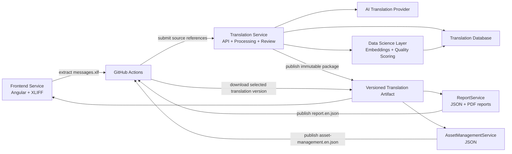

# Translation Platform POC Plan

## Purpose

Build a proof of concept for a centralized translation platform that is close to production quality. The goal is to let frontend and backend services consume translations from one source of truth while remaining independently deployable.

The POC should prove that:

- Consumer services can extract or provide source translation keys.
- The Translation Service can translate, store, review, validate, and package translations.
- The Translation Service can demonstrate AI-assisted translation and data science based quality analysis.
- Each consumer service can build and deploy with a specific translation package version.
- GitHub Actions can orchestrate CI/CD as much as possible.
- Infrastructure and service deployment are independent and repeatable.

## Services In Scope

### Frontend Service

- Uses Angular i18n.
- Provides `messages.xlf` as the source reference file.
- Consumes localized XLIFF files:
  - `messages.fr.xlf`
  - `messages.de.xlf`
  - Later: other supported languages.
- Is packaged with a specific translation artifact version during build.

### ReportService

- Generates reports that require translated labels, titles, table headers, and messages.
- Provides a source JSON file, for example:
  - `report.en.json`
- Consumes localized JSON files:
  - `report.fr.json`
  - `report.de.json`
- Generates a simple PDF report in the POC.

### AssetManagementService

- Manages backend or domain-specific translation keys for asset management.
- Provides a source JSON file, for example:
  - `asset-management.en.json`
- Consumes localized JSON files:
  - `asset-management.fr.json`
  - `asset-management.de.json`

### Translation Service

- Owns the translation database.
- Receives source translation references from consumer services.
- Supports XLIFF for Angular frontend translations.
- Supports JSON for backend services.
- Calls an AI translation provider such as OpenAI or Azure OpenAI.
- Uses data science capabilities such as embeddings, similarity search, glossary checks, and translation quality scoring.
- Stores translation state, review status, and metadata.
- Generates versioned translation artifacts for consumer services.
- Publishes translation artifacts through GitHub-compatible delivery.

## Target Architecture



## Key Design Decisions

### Translation Service Is the Source of Truth

Consumer services should not manually maintain translated files. They own only their source-language reference files. The Translation Service owns generated translations and their status.

### Translation Artifacts Must Be Immutable

Avoid relying on a mutable `latest` zip during deployment. Each generated package must have a unique version.

Example:

```text
translation-artifact-2026.07.07.1.zip
translation-artifact-2026.07.07.2.zip
translation-artifact-2026.07.08.1.zip
```

Consumer deployments may use `latest-approved`, but the resolved immutable version must be recorded in the build logs and deployment metadata.

### Each Service Is Independently Deployable

Each service must have:

- Its own infrastructure deployment workflow.
- Its own application deployment workflow.
- Its own build, test, and package workflow.
- Its own translation consumption step.

Translation generation should not force every consumer service to redeploy.

### GitHub Is the Main Orchestrator

Prefer GitHub Actions for:

- CI checks.
- Source translation extraction.
- Triggering translation ingestion.
- Packaging releases.
- Deploying infrastructure.
- Deploying services.
- Downloading translation packages during consumer builds.

If Azure is used for hosting, GitHub Actions can still deploy to Azure through OIDC and Azure CLI.

### AI and Data Science Must Be Explainable

AI output should not be treated as automatically correct. The POC should expose why a translation was selected and how confident the system is.

For each generated translation, store:

- AI model or deployment used.
- Similar approved examples used as context.
- Glossary rules applied.
- Quality score.
- Review status.
- Human correction history, if any.

## Data Science and AI POC Scope

The POC should include visible AI and data science capabilities while staying small enough to deliver.

### Capability 1: AI Translation Generation

Use an AI translation provider to generate missing translations for configured target languages.

Minimum POC behavior:

- Translate missing `fr` and `de` values.
- Preserve the English source text.
- Return structured JSON from the AI provider.
- Mark generated translations as `new` or `pending-review`.
- Log the model deployment used for each generation run.

Near-production safeguards:

- Validate AI output before storing it.
- Reject output when the English text was changed.
- Reject output when required languages are missing.
- Retry transient provider failures.
- Keep prompts versioned.

### Capability 2: Translation Memory With Embeddings

Use embeddings to find approved translations that are semantically similar to new source text.

Example:

```text
New source: Save settings
Similar approved source: Save configuration
Suggested French context: Enregistrer la configuration
```

Minimum POC behavior:

- Store an embedding for each canonical English text.
- Retrieve the top similar approved translations for each new text.
- Add similar examples to the AI prompt.
- Record which examples were used.

Near-production safeguards:

- Use only approved translations as prompt examples.
- Cap the number of examples to control token cost.
- Avoid examples from unrelated service domains when service context is available.

### Capability 3: Glossary and Terminology Checks

Maintain a product glossary for important domain terms.

Example:

```json
{
  "asset": {
    "fr": "actif",
    "de": "Asset"
  },
  "maintenance": {
    "fr": "maintenance",
    "de": "Wartung"
  }
}
```

Minimum POC behavior:

- Load glossary rules from a JSON file or database table.
- Check generated translations against glossary rules.
- Add glossary violations to the quality report.

Near-production safeguards:

- Support service-specific glossary rules.
- Allow exceptions with justification.
- Require review for glossary violations.

### Capability 4: Translation Quality Scoring

Compute a simple quality score for each generated translation.

Example scoring inputs:

- Required language exists.
- Translation is not empty.
- Translation is not identical to English unless allowed.
- Placeholders are preserved.
- Glossary rules are respected.
- Similar approved translations are consistent.
- Text length is reasonable for UI labels.

Minimum POC behavior:

- Produce a score from `0.0` to `1.0`.
- Mark translations below a threshold as `needs-review`.
- Include low-score translations in the quality report.

Near-production safeguards:

- Do not block all deployments at first.
- Start with warnings in CI.
- Move critical checks, such as missing placeholders, to blocking errors.

### Capability 5: Quality Report

Generate a quality report whenever a translation artifact is created.

The report should include:

- Translation coverage by service and language.
- Number of generated translations.
- Number of approved translations.
- Number of translations that need review.
- Missing translations.
- Glossary violations.
- Placeholder violations.
- Low-quality-score translations.

The report can be published as:

- A Markdown summary in GitHub Actions.
- A JSON file inside the translation artifact.
- A release asset next to the translation package.

### Capability 6: Reviewer Feedback Loop

Use human corrections as data for future translation decisions.

Minimum POC behavior:

- Store reviewer corrections with language, reason, service, and timestamp.
- Prefer approved human corrections over newly generated AI translations.
- Use approved corrections as examples for future AI prompts.

Near-production safeguards:

- Keep full correction history.
- Track who approved each correction.
- Allow rollback to a previous approved translation.

## Translation Artifact Contract

The Translation Service should publish a zip file with a manifest.

Example:

```text
translation-artifact-2026.07.07.1.zip
  manifest.json
  frontend/messages.fr.xlf
  frontend/messages.de.xlf
  report-service/report.fr.json
  report-service/report.de.json
  asset-management-service/asset-management.fr.json
  asset-management-service/asset-management.de.json
```

Example `manifest.json`:

```json
{
  "artifactVersion": "2026.07.07.1",
  "createdAt": "2026-07-07T18:00:00Z",
  "sourceLocale": "en",
  "status": "approved",
  "services": {
    "frontend": {
      "format": "xlf",
      "files": {
        "fr": "frontend/messages.fr.xlf",
        "de": "frontend/messages.de.xlf"
      }
    },
    "report-service": {
      "format": "json",
      "files": {
        "fr": "report-service/report.fr.json",
        "de": "report-service/report.de.json"
      }
    },
    "asset-management-service": {
      "format": "json",
      "files": {
        "fr": "asset-management-service/asset-management.fr.json",
        "de": "asset-management-service/asset-management.de.json"
      }
    }
  }
}
```

## Source Reference Contract

Each consumer service should submit a source reference file plus metadata.

Example metadata:

```json
{
  "serviceName": "frontend",
  "serviceType": "frontend",
  "format": "xlf",
  "sourceLocale": "en",
  "sourceFile": "messages.xlf",
  "outputPattern": "messages.{locale}.xlf",
  "requiredLocales": ["fr", "de"],
  "repository": "bobst/frontend-service",
  "commitSha": "abc123"
}
```

For backend services:

```json
{
  "serviceName": "report-service",
  "serviceType": "backend",
  "format": "json",
  "sourceLocale": "en",
  "sourceFile": "report.en.json",
  "outputPattern": "report.{locale}.json",
  "requiredLocales": ["fr", "de"],
  "repository": "bobst/report-service",
  "commitSha": "abc123"
}
```

## Recommended GitHub Delivery Options

### POC Recommendation: GitHub Releases

Use GitHub Releases in the Translation Service repository:

- Tag: `translations-2026.07.07.1`
- Release asset: `translation-artifact-2026.07.07.1.zip`
- Release asset: `manifest.json`

Advantages:

- Easy to inspect.
- Easy to download from GitHub Actions.
- Good enough for POC and demos.
- Supports immutable version references.

### Production Candidate: GitHub Packages or OCI Artifact

For production, consider publishing translation packages as versioned packages:

- GitHub Packages
- OCI artifact in a container registry
- Azure Blob Storage with immutable versioning

## GitHub Actions Workflows

### Translation Service CI

Trigger:

- Pull request
- Push to main

Steps:

- Install dependencies.
- Run linting.
- Run unit tests.
- Run format checks.
- Run security/dependency scan.
- Build deployable service package.

Acceptance criteria:

- CI fails if tests fail.
- CI fails if code cannot be packaged.
- CI publishes test results and coverage.

### Translation Service Infrastructure Deployment

Trigger:

- Manual `workflow_dispatch`
- Push to `main` for development environment

Steps:

- Authenticate to Azure using GitHub OIDC.
- Validate infrastructure templates.
- Deploy or update infrastructure.
- Output service endpoints and resource names.

Acceptance criteria:

- Infrastructure can be deployed without manually using the Azure Portal.
- Secrets are not stored in source control.
- Workflow can target at least `dev`.

### Translation Service Application Deployment

Trigger:

- Push to `main`
- Manual `workflow_dispatch`

Steps:

- Build service.
- Run tests.
- Package function app or service.
- Deploy application to existing infrastructure.
- Run smoke test against health endpoint.

Acceptance criteria:

- Service deployment does not recreate infrastructure.
- Failed smoke test fails the workflow.
- Deployed version is visible in logs.

### Consumer Service Translation Extraction

Trigger:

- Pull request
- Push to main

Frontend steps:

- Install dependencies.
- Build.
- Run tests.
- Extract Angular i18n:

```bash
npx ng extract-i18n --format=xlf --output-path src/locale
```

- Upload `messages.xlf` to the Translation Service or dispatch an ingestion workflow.

Backend steps:

- Build.
- Run tests.
- Validate source JSON file.
- Upload source JSON to the Translation Service or dispatch an ingestion workflow.

Acceptance criteria:

- Source translation file is generated or validated on each CI run.
- Invalid translation source files fail CI.
- The Translation Service receives enough metadata to identify the service.

### Translation Artifact Generation

Trigger:

- Source translation ingestion completed.
- Manual `workflow_dispatch`.
- Scheduled nightly workflow.

Steps:

- Load translation records from the database.
- Generate missing translations.
- Retrieve similar approved translations using embeddings.
- Apply glossary and terminology checks.
- Run quality checks.
- Build localized files per service.
- Create `manifest.json`.
- Create translation quality report.
- Package zip file.
- Publish GitHub Release or package.

Acceptance criteria:

- Artifact version is immutable.
- Artifact contains all required service files.
- Missing required translations fail or block approval.
- Manifest identifies each included service and locale.
- Quality report is attached to the artifact or release.

### Consumer Service Deployment With Translations

Trigger:

- Push to main
- Manual `workflow_dispatch`

Inputs:

- `translationVersion`, optional.
- If omitted, resolve latest approved translation version.

Steps:

- Download translation artifact.
- Verify artifact manifest.
- Copy required translation files into the service build folder.
- Build the service with the selected translations.
- Run tests.
- Deploy application.
- Record deployed application version and translation artifact version.

Acceptance criteria:

- Deployment is reproducible using the same commit and translation version.
- Deployment fails if required translation files are missing.
- Build logs show the resolved translation artifact version.

## Epics and User Story Candidates

### Epic 1: Translation Source Contracts

Goal: Define how each service provides translation keys and source text.

Story candidates:

- As a frontend developer, I want Angular to extract `messages.xlf` so that the Translation Service can translate frontend labels.
- As a backend developer, I want ReportService to expose `report.en.json` so that report labels can be translated.
- As a backend developer, I want AssetManagementService to expose `asset-management.en.json` so that domain labels can be translated.
- As a platform engineer, I want each source file to include service metadata so that the Translation Service does not infer service identity from filenames.

Acceptance criteria:

- Frontend source file is valid XLIFF.
- Backend source files are valid JSON.
- Each source reference includes service name, format, source locale, target locales, and commit SHA.

### Epic 2: Translation Service Ingestion

Goal: Receive and store source translation references.

Story candidates:

- As a Translation Service, I want to receive source translation files from consumer pipelines.
- As a Translation Service, I want to detect new keys, changed English text, and removed keys.
- As a Translation Service, I want to store service ownership for each translation key.
- As a Translation Service, I want to support XLIFF and JSON source formats.

Acceptance criteria:

- New keys are added to the database.
- Changed English text creates an updated canonical translation entry.
- Existing keys are not duplicated.
- Unsupported formats are rejected with clear errors.

### Epic 3: AI Translation Generation

Goal: Generate missing translations using an AI translation provider.

Story candidates:

- As a Translation Service, I want to generate missing French and German translations.
- As a Translation Service, I want to reuse approved translations for similar text.
- As a Translation Service, I want to use examples from previous translations to improve consistency.
- As a Translation Service, I want to keep technical and industrial terminology consistent.

Acceptance criteria:

- Missing translations are generated for configured locales.
- Generated translations are marked with a review status.
- The English source text is not changed by the AI response.
- Failed AI calls are logged and retried safely.
- AI prompts and model deployment names are traceable.

### Epic 4: Data Science and Translation Intelligence

Goal: Use data science to improve consistency, quality, and review efficiency.

Story candidates:

- As a Translation Service, I want to store embeddings for canonical English text so that I can find similar approved translations.
- As a Translation Service, I want to use similar approved translations as AI prompt examples so that wording stays consistent.
- As a translation reviewer, I want low-confidence translations to be highlighted so that I can focus review effort.
- As a product owner, I want glossary violations to be detected so that product terminology is consistent.
- As a platform engineer, I want a translation quality report so that CI/CD can show translation health.

Acceptance criteria:

- Embeddings are stored for canonical English text.
- Similarity search returns approved translation examples.
- Quality score is calculated for generated translations.
- Glossary violations are listed in the quality report.
- Low-score translations are marked as `needs-review`.

### Epic 5: Review and Approval

Goal: Allow generated translations to be reviewed before production use.

Story candidates:

- As a reviewer, I want to see translations by language so that I can validate them.
- As a reviewer, I want to propose corrections so that terminology is accurate.
- As a reviewer, I want to approve or reject translations.
- As a platform owner, I want only approved translations in release artifacts.

Acceptance criteria:

- Review status is tracked per key and language.
- Corrections are stored with reason and reviewer metadata.
- Release artifacts can include only approved translations.

### Epic 6: Translation Artifact Packaging

Goal: Generate versioned artifacts that consumer services can use during deployment.

Story candidates:

- As a Translation Service, I want to generate XLIFF files for frontend services.
- As a Translation Service, I want to generate JSON files for backend services.
- As a Translation Service, I want to package translations per service and locale.
- As a consumer pipeline, I want a manifest so that I can verify the package before build.

Acceptance criteria:

- Artifact has an immutable version.
- Artifact includes `manifest.json`.
- Artifact includes required files for each service.
- Artifact generation fails if required files are missing.
- Artifact includes or references the quality report.

### Epic 7: Frontend Integration

Goal: Package the Angular frontend with translated XLIFF files.

Story candidates:

- As a frontend pipeline, I want to download the selected translation artifact.
- As a frontend pipeline, I want to copy `messages.fr.xlf` and `messages.de.xlf` into the Angular locale folder.
- As a frontend pipeline, I want to build localized Angular outputs.
- As a user, I want to select a language and see translated UI text.

Acceptance criteria:

- Frontend build fails if required XLIFF files are missing.
- Localized build outputs are produced.
- Translation artifact version is logged during deployment.

### Epic 8: ReportService Integration

Goal: Package ReportService with translated JSON files and generate translated reports.

Story candidates:

- As a ReportService pipeline, I want to download the selected translation artifact.
- As a ReportService, I want to load `report.{locale}.json` at runtime or startup.
- As a user, I want a PDF report generated in the selected language.
- As a developer, I want missing report labels to fail tests or produce clear warnings.

Acceptance criteria:

- ReportService can generate at least one translated PDF.
- Required report labels are present for each configured locale.
- Deployment records the translation artifact version.

### Epic 9: AssetManagementService Integration

Goal: Package AssetManagementService with translated JSON files.

Story candidates:

- As an AssetManagementService pipeline, I want to download the selected translation artifact.
- As an AssetManagementService, I want to load translated labels from JSON files.
- As a developer, I want CI to validate that all asset management translation keys exist.

Acceptance criteria:

- Required translation files are present during build.
- Missing required keys fail CI.
- Service logs include the loaded translation version.

### Epic 10: GitHub Actions CI/CD

Goal: Use GitHub Actions as the main automation platform.

Story candidates:

- As a platform engineer, I want each service to have CI workflows.
- As a platform engineer, I want each service to have independent infrastructure deployment workflows.
- As a platform engineer, I want each service to have independent application deployment workflows.
- As a release manager, I want to deploy a service with a selected translation version.

Acceptance criteria:

- CI runs on pull requests.
- Infrastructure deployment can be triggered manually.
- Application deployment can be triggered manually.
- Consumer deployments can specify a translation artifact version.

### Epic 11: Quality, Security, and Observability

Goal: Make the POC close to production quality.

Story candidates:

- As a platform engineer, I want dependency and secret scanning in CI.
- As a platform engineer, I want translation quality checks.
- As a platform engineer, I want structured logs for translation ingestion and artifact generation.
- As a product owner, I want a translation quality report.

Acceptance criteria:

- CI includes unit tests and basic security checks.
- Translation artifact generation produces a quality report.
- Logs include service name, artifact version, locale, and operation result.
- Failed translation jobs are visible and diagnosable.

## Data Model POC

### Service Registration

```json
{
  "serviceName": "frontend",
  "format": "xlf",
  "sourceLocale": "en",
  "requiredLocales": ["fr", "de"],
  "outputPattern": "messages.{locale}.xlf",
  "repository": "bobst/frontend-service"
}
```

### Translation Entry

```json
{
  "key": "common.save",
  "sourceText": "Save",
  "sourceLocale": "en",
  "services": ["frontend", "report-service"],
  "translations": {
    "fr": {
      "value": "Enregistrer",
      "status": "approved",
      "qualityScore": 0.94,
      "provider": "azure-openai",
      "modelDeployment": "translation-llm",
      "promptVersion": "translation-prompt-v1"
    },
    "de": {
      "value": "Speichern",
      "status": "approved",
      "qualityScore": 0.91,
      "provider": "azure-openai",
      "modelDeployment": "translation-llm",
      "promptVersion": "translation-prompt-v1"
    }
  },
  "embedding": [0.012, 0.245, -0.034],
  "similarApprovedExamples": ["common.save.configuration", "settings.save"],
  "glossaryViolations": []
}
```

### Glossary Term

```json
{
  "sourceTerm": "maintenance",
  "description": "Industrial maintenance context",
  "translations": {
    "fr": "maintenance",
    "de": "Wartung"
  },
  "services": ["report-service", "asset-management-service"],
  "caseSensitive": false
}
```

### Translation Quality Report

```json
{
  "artifactVersion": "2026.07.07.1",
  "createdAt": "2026-07-07T18:00:00Z",
  "coverage": {
    "frontend": {
      "fr": 0.98,
      "de": 0.96
    },
    "report-service": {
      "fr": 1.0,
      "de": 0.94
    }
  },
  "summary": {
    "generatedTranslations": 34,
    "approvedTranslations": 120,
    "needsReview": 8,
    "glossaryViolations": 2,
    "placeholderViolations": 0
  }
}
```

### Artifact Record

```json
{
  "artifactVersion": "2026.07.07.1",
  "status": "approved",
  "createdAt": "2026-07-07T18:00:00Z",
  "includedServices": ["frontend", "report-service", "asset-management-service"],
  "includedLocales": ["fr", "de"],
  "commitSha": "abc123",
  "qualityReportPath": "quality-report.json"
}
```

## Quality Gates

### Source File Validation

- XLIFF file is parseable.
- JSON file is parseable.
- No duplicate keys.
- No empty source text.
- Required metadata exists.

### Translation Validation

- Required locales are present.
- Placeholders are preserved.
- ICU/plural syntax is preserved where applicable.
- No untranslated English text remains unless explicitly allowed.
- Glossary rules are respected.

### AI and Data Science Validation

- AI response is valid structured JSON.
- AI response keeps the original English text unchanged.
- Similarity examples come only from approved translations.
- Embeddings are generated for new canonical English text.
- Quality score is calculated for each generated translation.
- Low-score translations are marked as `needs-review`.
- Glossary violations are reported.

### Artifact Validation

- Manifest exists.
- Every file listed in the manifest exists in the zip.
- Every required service has all required locale files.
- Artifact version is unique.
- Quality report exists.

## Security Requirements

- Use GitHub OIDC for Azure authentication.
- Do not store cloud credentials in repository secrets when OIDC is possible.
- Store AI provider secrets in GitHub environments or Azure Key Vault.
- Use least-privilege deployment identities.
- Restrict production deployments with GitHub environments and approvals.
- Run dependency scanning in CI.
- Run secret scanning in CI or rely on GitHub Advanced Security if available.

## Observability Requirements

Translation Service should log:

- Source ingestion started and completed.
- Service name and source file format.
- Number of new keys.
- Number of changed keys.
- Number of generated translations.
- Number of failed translations.
- Number of low-score translations.
- Number of glossary violations.
- AI model deployment and prompt version used.
- Similarity search execution time.
- Artifact version generated.
- Artifact publication result.

Consumer services should log:

- Translation artifact version loaded.
- Missing translation file errors.
- Missing key errors.

## POC Milestones

### Milestone 1: Contracts and Repository Workflows

- Define source file contracts.
- Define artifact manifest.
- Add CI workflows for Translation Service.
- Add CI workflow examples for frontend and backend consumers.

### Milestone 2: Translation Service Packaging

- Generate versioned translation artifacts.
- Include frontend XLIFF files.
- Include backend JSON files.
- Publish artifact through GitHub Releases.

### Milestone 3: AI and Data Science Capabilities

- Generate missing translations using AI.
- Store embeddings for canonical English text.
- Retrieve similar approved translations.
- Apply glossary checks.
- Calculate quality scores.
- Generate a translation quality report.

### Milestone 4: Frontend Consumer

- Extract Angular XLIFF.
- Download selected translation artifact.
- Build localized Angular app.
- Deploy frontend independently.

### Milestone 5: ReportService Consumer

- Add report source JSON.
- Download selected translation artifact.
- Generate translated PDF report.
- Deploy ReportService independently.

### Milestone 6: AssetManagementService Consumer

- Add asset management source JSON.
- Download selected translation artifact.
- Validate required translation keys.
- Deploy AssetManagementService independently.

### Milestone 7: Near-Production Hardening

- Add artifact version locking.
- Add quality report.
- Add smoke tests.
- Add rollback instructions.
- Add monitoring and logs.

## Suggested Story Template

```markdown
## Story: <short title>

As a <role>,
I want <capability>,
so that <business value>.

### Acceptance Criteria

- <criterion 1>
- <criterion 2>
- <criterion 3>

### Technical Notes

- <implementation detail>
- <workflow or service impact>

### Out of Scope

- <explicit exclusions>
```

## Initial Backlog

1. Define translation source metadata schema.
2. Define translation artifact manifest schema.
3. Create GitHub Actions CI for Translation Service.
4. Create GitHub Actions infrastructure deployment workflow for Translation Service.
5. Create GitHub Actions application deployment workflow for Translation Service.
6. Add versioned artifact generation to Translation Service.
7. Publish translation artifacts to GitHub Releases.
8. Add artifact download workflow step for consumer services.
9. Add Angular XLIFF extraction workflow.
10. Add ReportService JSON source validation.
11. Add AssetManagementService JSON source validation.
12. Add artifact validation script.
13. Add translation quality report.
14. Add smoke tests after deployment.
15. Add rollback documentation using previous artifact versions.
16. Add AI translation generation for missing translations.
17. Add embedding generation for canonical English text.
18. Add similarity search over approved translations.
19. Add glossary JSON or glossary database table.
20. Add quality scoring for generated translations.
21. Add CI summary for coverage, glossary violations, and low-score translations.

## Main Risks

### Mutable Translation Artifacts

Risk: A service may deploy with a different translation package than expected.

Mitigation: Use immutable versions and record the translation version in deployment metadata.

### Fragile Service Identification

Risk: Translation Service may assign files to the wrong service if it infers service names from filenames.

Mitigation: Require explicit service metadata.

### XLIFF Complexity

Risk: Angular XLIFF can contain placeholders, ICU syntax, and metadata that must be preserved.

Mitigation: Add XLIFF tests using real Angular-generated files.

### Missing Translation Coverage

Risk: Consumer services may deploy with missing labels.

Mitigation: Add CI validation and fail deployments when required translations are missing.

### AI Translation Inconsistency

Risk: AI may translate the same term differently across services.

Mitigation: Use glossary rules, translation memory, and review status.

### Low-Quality AI Output

Risk: AI output may be grammatically incorrect, incomplete, or not valid JSON.

Mitigation: Validate all AI responses, keep generated translations in `needs-review` until approved, and block artifact publication only for critical validation failures.

### Data Science Cost and Latency

Risk: Embedding generation and similarity search may increase pipeline duration and provider cost.

Mitigation: Cache embeddings, generate embeddings only for changed canonical text, and limit top similar examples.

### Sensitive Text Sent to AI Provider

Risk: Source strings may contain sensitive product or customer data.

Mitigation: Add source text classification rules, avoid sending secrets or customer-specific values, and document what data is allowed to be sent to the AI provider.

## Definition of Done for the POC

- Translation Service is independently deployable.
- Each consumer service is independently deployable.
- Infrastructure and application deployment are separated.
- GitHub Actions can run CI and deployment workflows.
- Frontend consumes generated XLIFF files.
- ReportService consumes generated JSON files.
- AssetManagementService consumes generated JSON files.
- Translation artifacts are versioned and immutable.
- Consumer deployments record the translation artifact version.
- AI generates at least one missing translation per target language.
- Embeddings are generated and used to retrieve similar approved examples.
- Glossary checks run during artifact generation.
- Quality scores are calculated and included in the quality report.
- At least one quality report is generated.
- At least one rollback scenario is documented and tested.
